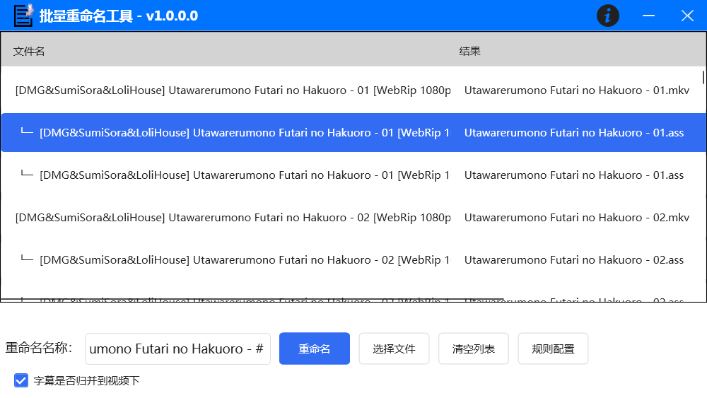
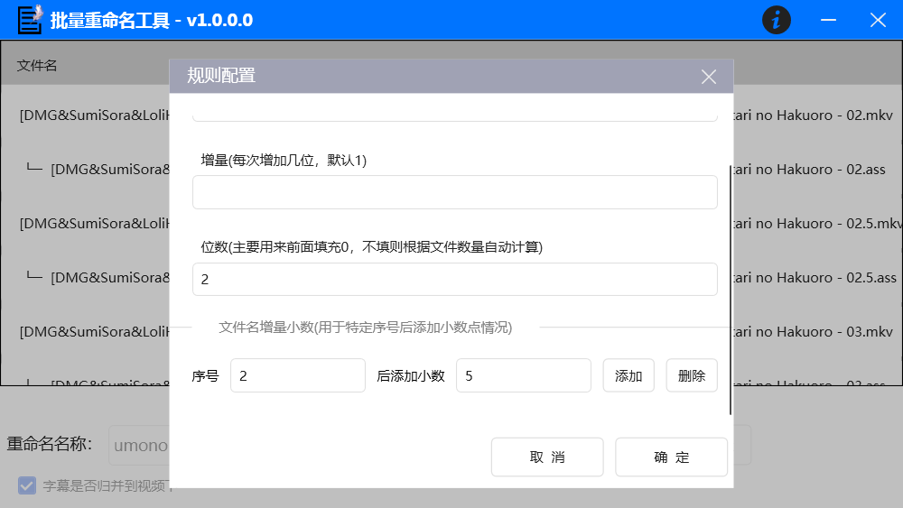
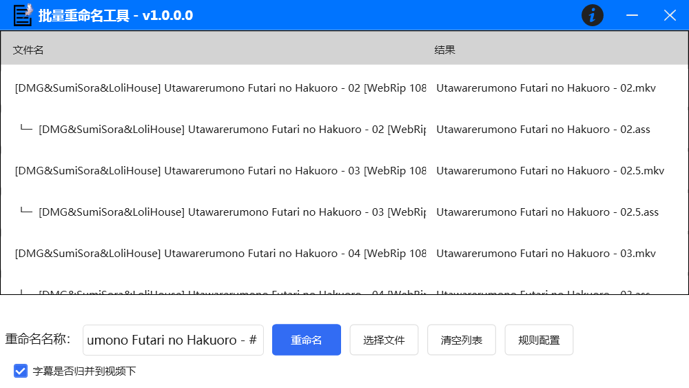

## 批量重命名小工具

工具目前采用.net framework4.7.2进行开发，
mvvm框架上使用caliburn，使用Fody.PropertyChanged进行实体代码生成

实现了文件命名功能
* 自定义文件起始序号
* 自定义文件序号增量
* 自定义文件序号长度补0
* 自定义额外序号后添加小数点
* 选中列表项按delete删除
* 选中拖拽

如果文件包含字幕和视频，则会如下展示

并且可以对命名规则另外配置，比如

* 生成的位数
* 每次增量
* 开始序号
* 对某个序号生成小数位

最后会如下展示，在序号2后面生成了带小数位的文件名

